# springboot007-大学生租房平台的设计与实现

>  博主介绍：
>  Hey，我是程序员Chaers，一个专注于计算机领域的程序员
>  十年大厂程序员全栈开发‍ 日常分享项目经验 解决技术难题与技术推荐 承接各类网站设计，小程序开发，毕设等。
>  【计算机专业课程设计，毕业设计项目，Java，微信小程序，安卓APP都可以做，不仅仅是计算机专业，其它专业都可以】

## 本项目获取地址：https://www.bishecode.com/product/7/

## 3000套系统可挑选，获取链接：https://www.bishecode.com/

### 系统架构

> 前端：html | js | css | jquery | vue
>
> 后端：springboot | mybatis
> 
> 环境：jdk1.8+ | mysql | maven

# 一、内容包括
包括有  项目源码+项目论文+数据库源码+答辩ppt+远程调试成功

# 二、运行环境

> jdk版本：1.8 及以上； ide工具：IDEA； 数据库: mysql5.7及以上；编程语言: Java

# 三、需求分析

**3.1 可行性分析**

在正式对需要建设的项目进行投资前，有一个比较关键的步骤是不能缺少的，那就是可行性分析。它主要从当前技术，经济等角度去评估系统的可行性，在投资决策中常常采用这种科学的方法来论证项目。

**3.1.1 技术可行性**

当前，系统开发的技术已经发展成熟，而且通过计算机网络可以获取开发工具的使用方法，以及规范化编写的模块化代码，这些知识可以帮助开发者顺利完成本系统的编码工作。

**3.1.2 经济可行性**

本系统开发期间需要配置的软件环境，可以免费通过开发类官网下载安装，需要配置的硬件设备也不需要具备很高的性能，通常网吧电脑，或学校计算机机房的电脑都符合要求。因此，从经济方面考虑，大学生租房平台开发可行。

**3.1.3 操作可行性**

大学生租房平台根据用户使用习惯进行开发，设计的界面具有统一性，并具备优秀的导航功能。所以，只要会简单操作电脑的人员，可以无压力操作大学生租房平台。
总之，从上述的论证来看，本系统可以开发。

**3.2 系统流程**

流程图这样的工具可以直观反映出系统内部的操作逻辑，可以帮助用户更好的理解系统。

**3.2.1 操作流程**

进入本系统需要访问者提供验证信息。验证合格的访问者才能获取访问资格。其具体的操作流程见下图。访问者根据登录界面设置的信息项如实填写，待信息通过验证后，访问者可以进入指定的页面享受本系统提供的服务和阅读本系统的相关信息。

**3.2.2 登录流程**

本系统的登录模块，其内部的流程见下图。主要对访问本系统的人员提供的验证信息进行逐个判断，系统面对录入错误的信息会给出提示，比如，提示账号不对，或提示密码不匹配等提示信息。总之，在登录页面填写的所有信息都符合要求，访问者就登录成功了。
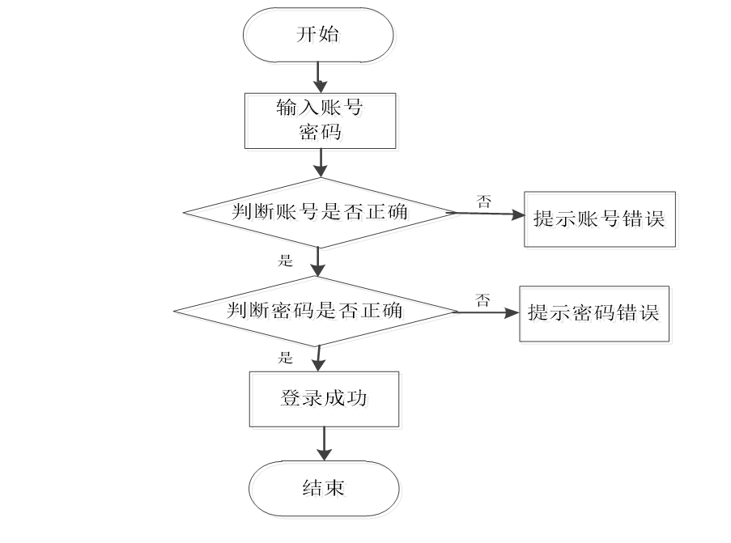

**3.3 性能需求**

进行需求分析，包括了根据用户实际需求制定功能，也涵盖了对即将设计的系统进行性能上的需求分析。所以一般分析系统时，一方面要分析系统功能，另一方面也要分析系统的性能。毕竟设计开发出一个好性能的系统可以确保系统的质量可靠。
接下来分析系统的性能，还要从界面友好性，系统的时间特性，系统的可靠性等方面来分析说明。

（1）时间特性要求：系统处理数据都有时间要求，这也是系统的时间特性。通常都会把数据处理的时间进行分析，也会设置用户请求的响应时间，还有系统在满负荷运行时可以偏离的范围数值等都需要提前分析确定。

（2）界面友好性：除了功能上需要考虑用户需求外，在人机交互界面的设计上，也需要考虑用户的使用习惯，包括界面的布局，界面基调选择以及颜色搭配等。尽量做到用户在接受简单的培训之后，可以对系统进行独立操作。

（3）系统可靠性：对于初学者而言，很容易出现一个问题，就是设计开发的系统，因为人为的误操作出现崩溃，有些也会导致电脑死机。这样的现象也说明这种容错能力低下的系统是不可靠的。完全不能作为生活中处理信息的系统。当下，系统开发要保证可靠性，设计时，把模块化和结构化的设计理念也考虑进来。如果遇到对时效性要求比较严格的系统，也需要采取其它的措施，比如双机系统，还有磁盘阵列等方式。还有就是一个可靠性的系统，对设备的供电能力也有要求。

# 四、功能模块

在前面分析的管理员功能的基础上，进行接下来的设计工作，最终展示设计的管理员结构图（见下图）。管理员管理房东和用户，对房东提交的信息审批信息进行审核，审核房东发布的房源信息。

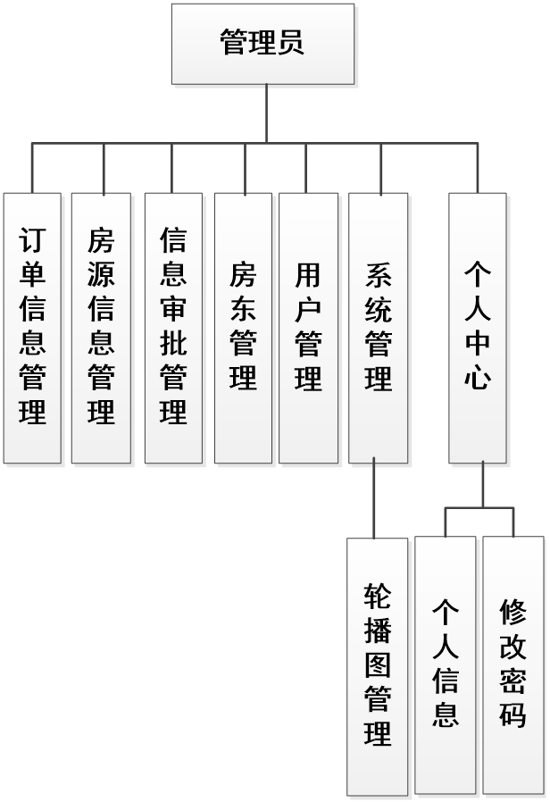

在前面分析的房东功能的基础上，进行接下来的设计工作，最终展示设计的房东结构图（见下图）。房东提交信息审批信息，发布房源信息，审核用户租房订单。

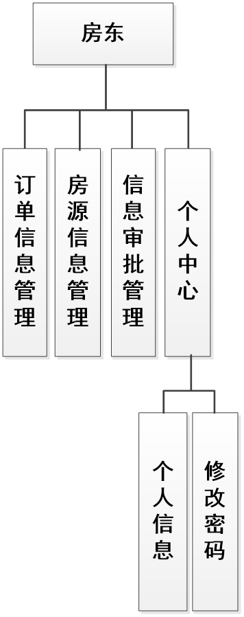

在前面分析的用户功能的基础上，进行接下来的设计工作，最终展示设计的用户结构图（见下图）。用户收藏房屋，租用房屋，支付租房订单。

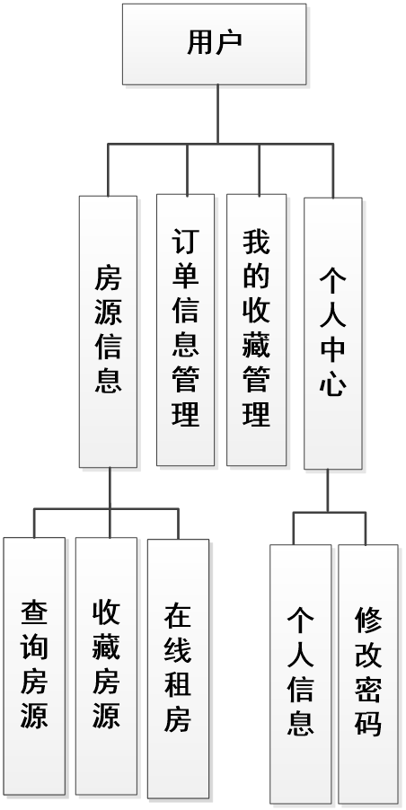

# 五、部分效果图展示

图5.1 房东管理页面【管理员进入指定功能操作区之后可以管理房东。其页面见下图。房东的资料需要管理员负责管理，包括修改，新增，删除等操作。】

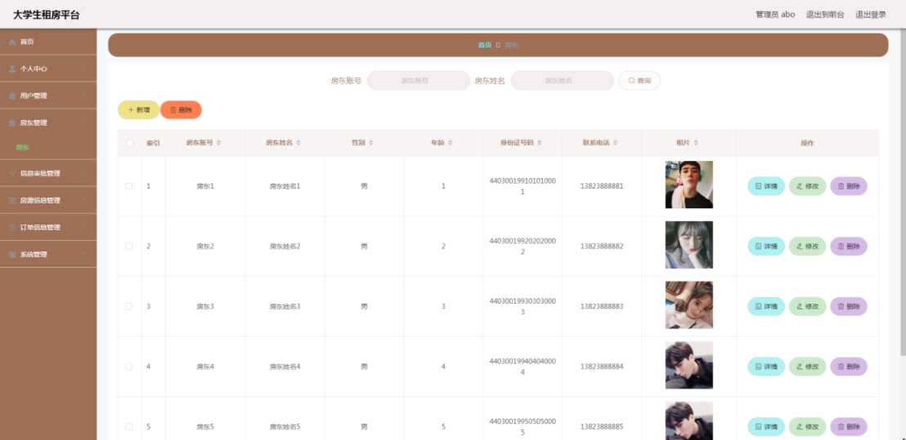

图5.2 信息审批管理页面【管理员进入指定功能操作区之后可以管理信息审批信息。其页面见下图。房东上传房产证和身份证信息，管理员查看后进行审批，审批通过之后，房东才可以发布房源信息。】
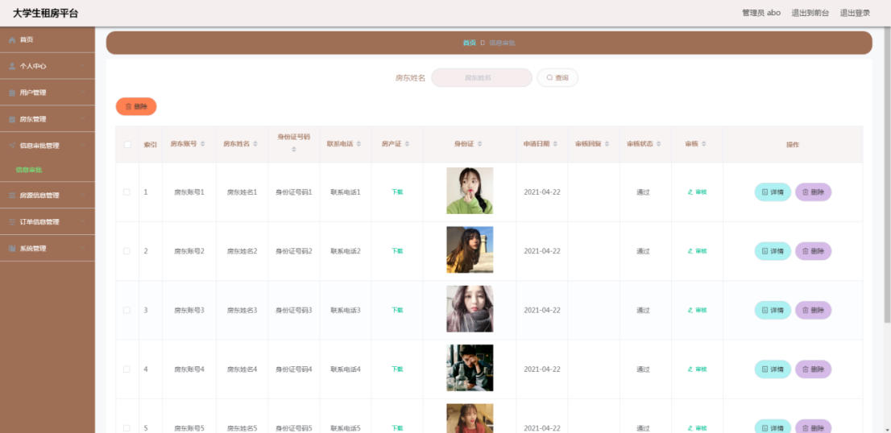

图5.3 房源信息管理【管理员进入指定功能操作区之后可以管理房源信息。其页面见下图。房东发布的房源信息需要先通过管理员的审核，然后才能展示在前台进行出租。】
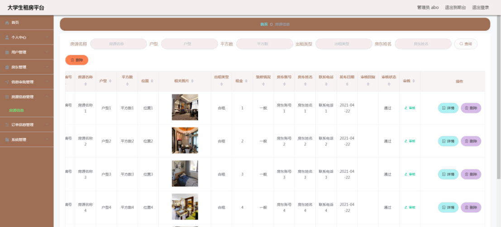

图5.4 信息审批管理页面【房东进入指定功能操作区之后可以管理信息审批信息。其页面见下图。房东查看信息审批信息是否通过审核，只有通过审核之后，房东才可以发布房源信息。】
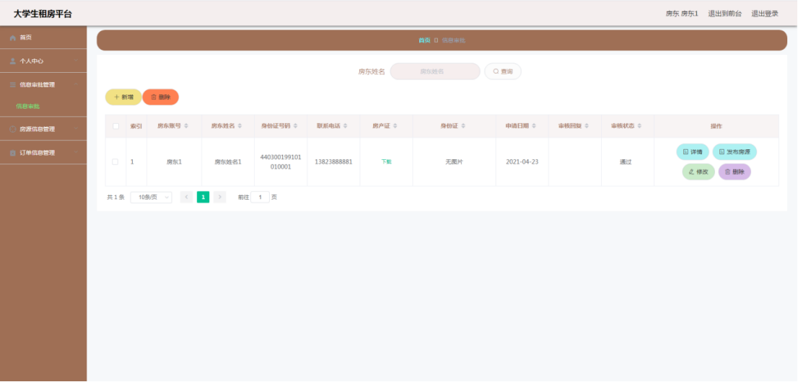

图5.5 房源信息管理页面【房东进入指定功能操作区之后可以管理房源信息。其页面见下图。房东发布的房源信息在进行正式出租前，也需要通过管理员的审核。】
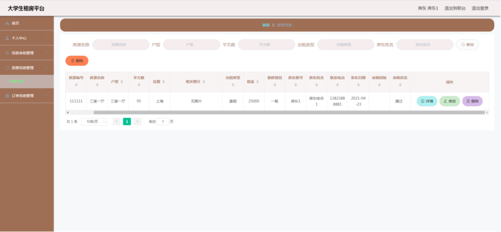

图5.6 订单信息管理页面【房东进入指定功能操作区之后可以管理订单信息。其页面见下图。用户租房后，房东需要查看用户是否支付，而且还要审核用户的租房订单。】
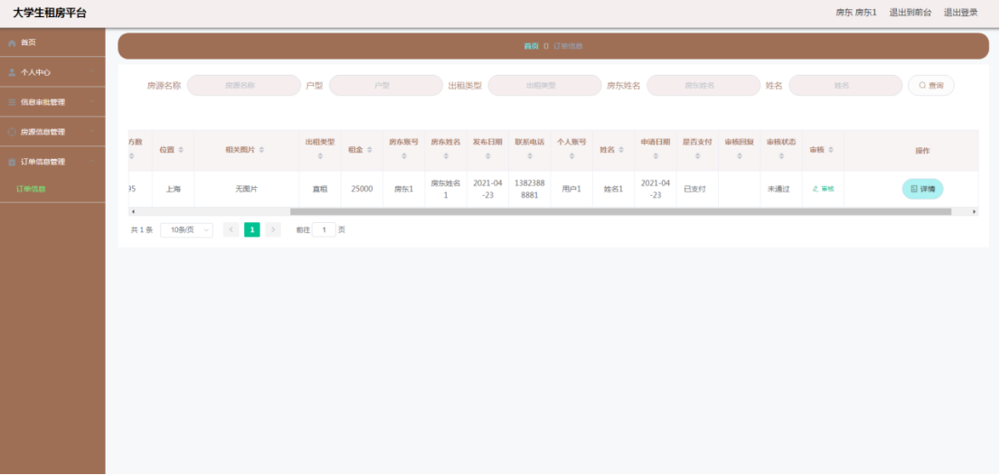

图5.7 房源信息页面【用户进入前台之后可以查看房源信息。其页面见下图。本页面显示所有要出租的房源信息，用户可以根据房源名称，户型，出租类型等字段查询所需房源信息。】
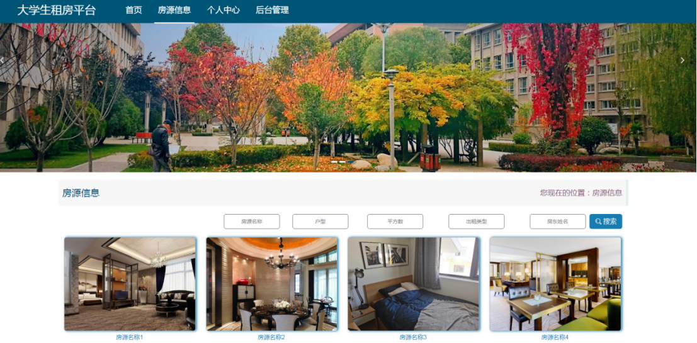

 <b>完整文章</b>
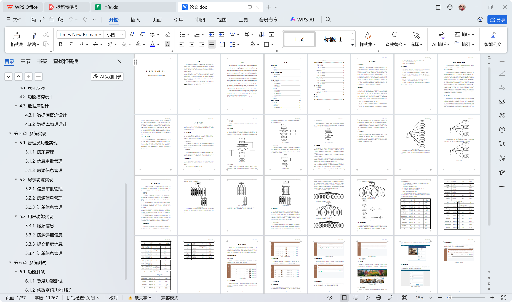
 

## 本项目获取地址：https://www.bishecode.com/product/7/

## 3000套系统可挑选，获取链接：https://www.bishecode.com/

